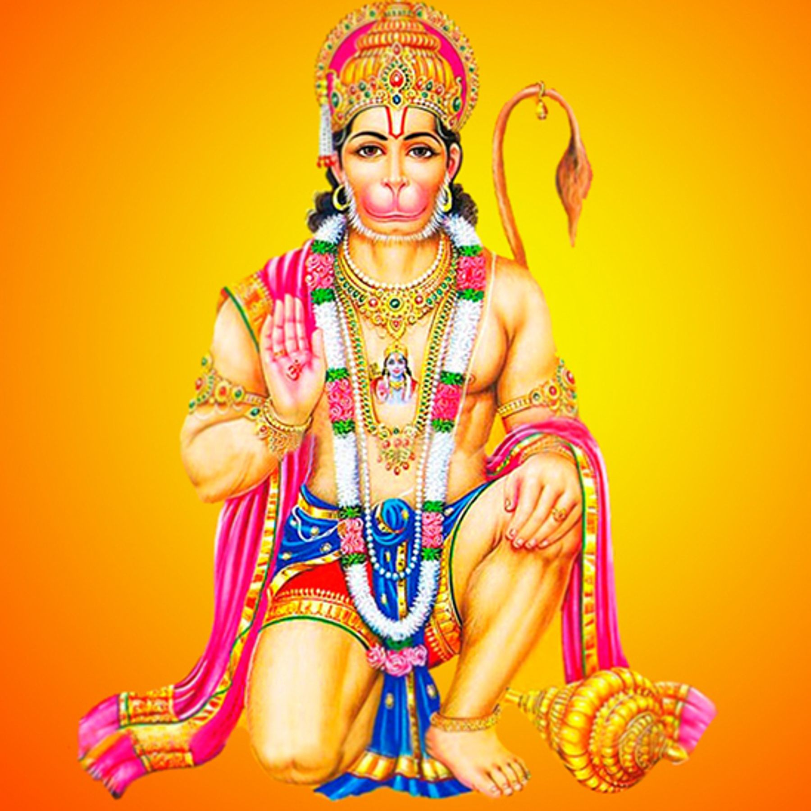
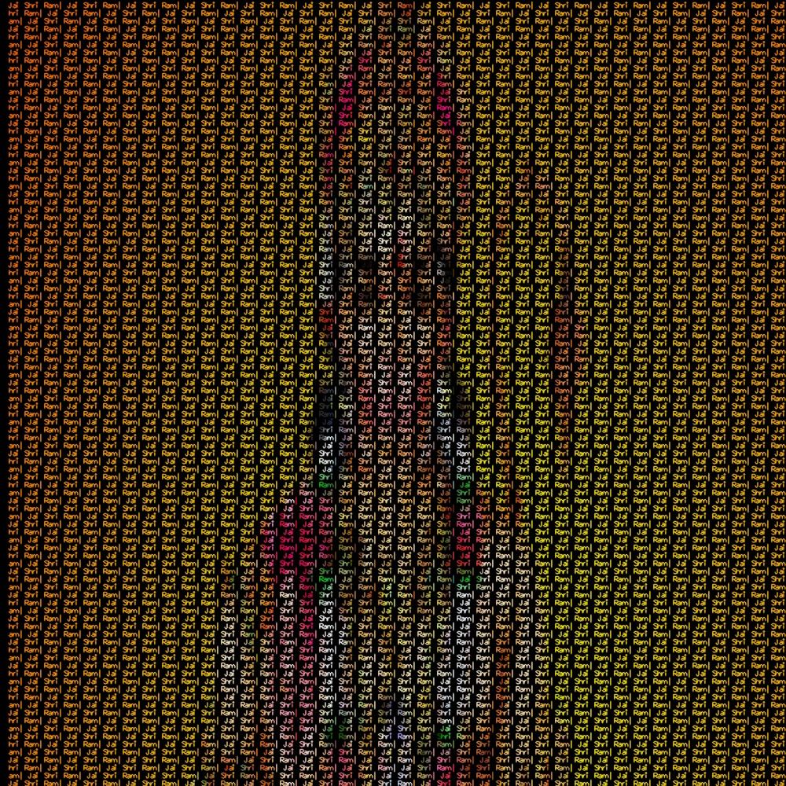
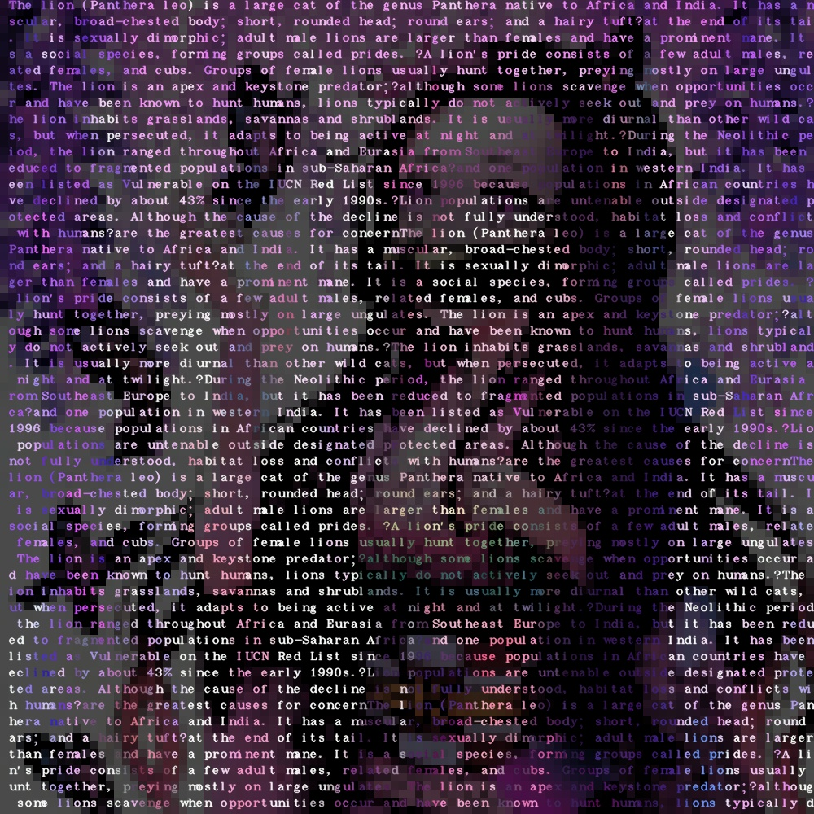
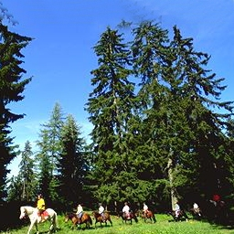
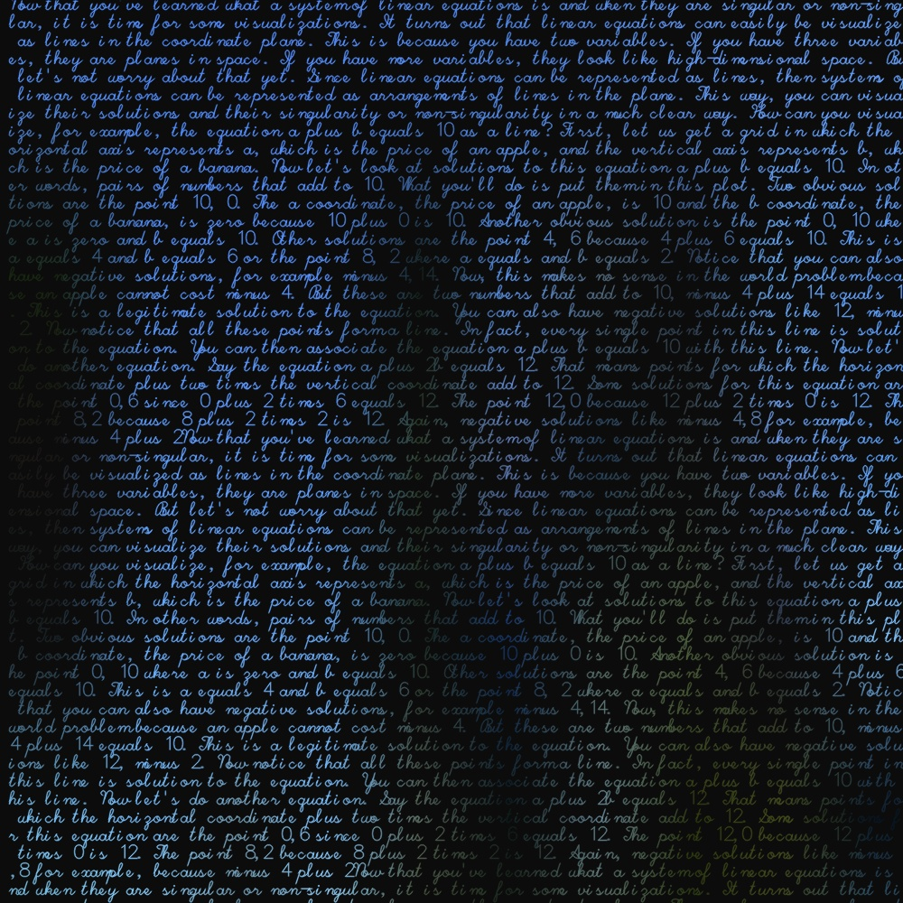
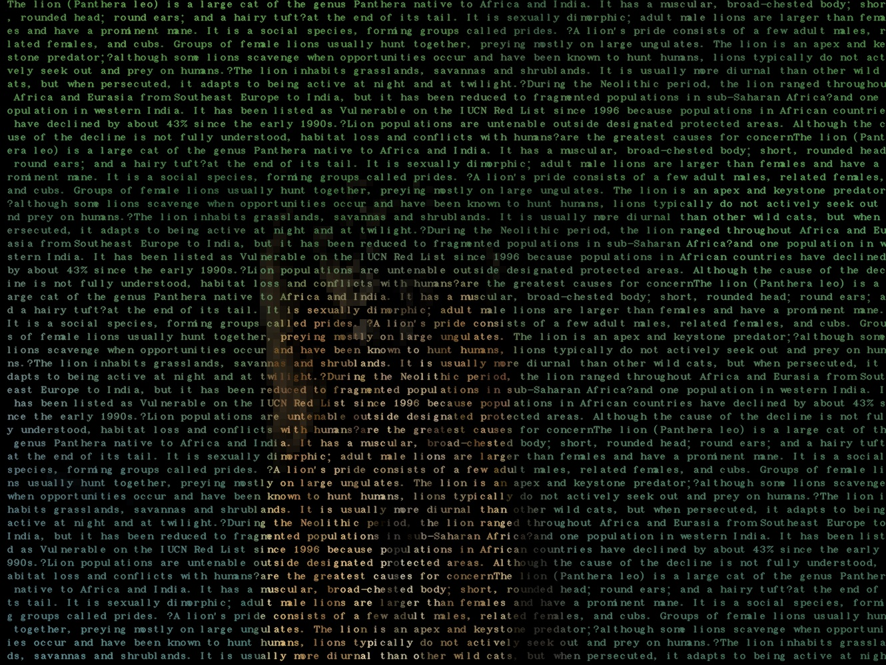

# image-to-text_image
Just a short tool to generate the image with characters representing the image. 
Parameters can be updated to get your required output

## Output 

 

 

 

 

 

- If you make something great, do share
